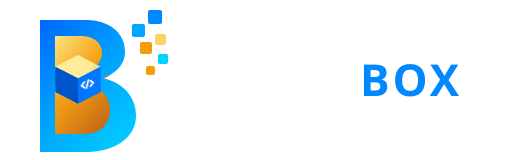

# Blow Box — 3D Landing Page Experience

A modern, minimal, 3D scroll-down landing page for technology company **Blow Box**, built around the brand's blue-and-gold visual identity.



## Features

- **Cinematic "Click to Enter" Portal**:
  - Floating 3D "B" emblem actively levitating and responding to mouse parallax.
  - Tilted dual orbital rings (Electric Cyan and Metallic Gold) with revolving diamond satellites.
  - Flanking typography and cursive script accent *"More Than Software"*.
  - Raycast click detection on the 3D "B" emblem and interactive enter button.
- **Controlled 3D Logo Scroll Transformation**:
  - Built with WebGL and Three.js.
  - As the user scrolls, the emblem unfolds: top/bottom curved blue ribbons glide along 3D arcs, inner champagne gold bevels pivot, central isometric Code Box levitates forward with its glowing `</>` glyph, and satellite data voxels expand in orbit.
- **Interactive 3D Service Cards**:
  - 8 core digital solutions with real-time 3D perspective tilt and dynamic cursor light tracking.
  - Click-to-inspect modal drawer displaying architecture stack tags and engineering deliverables.
- **Split-Screen About Section**:
  - Concise company narrative, core value pillars, and enterprise KPI metrics (`99.9%` Uptime, `150+` Products, `40+` Global Partners, `<200ms` Latency).
  - Spatial 3D viewport showcasing the Blow Box emblem in an architectural profile.
- **Finale & Logo Reassembly**:
  - Reverse gravitational convergence pulls all components back together, snapping into alignment with a radiant energy pulse.
  - Final CTA (*"Let’s build what’s next."*) and interactive conversation form with instant feedback.

## Tech Stack

- **Core**: Vanilla HTML5, CSS3, JavaScript (ES6+)
- **3D Graphics Engine**: Three.js (WebGL, Physically Based Materials, ACES Filmic Tone Mapping)
- **Typography**: Google Fonts (*Plus Jakarta Sans*, *Outfit*, *Alex Brush*)

## Local Development

You can run the project locally with any static web server:

```bash
# Using Python
python -m http.server 8080

# Or using Node.js
npx serve .
```

Open your browser at `http://localhost:8080/`.

## License

All rights reserved © 2026 Blow Box Software Solutions.
